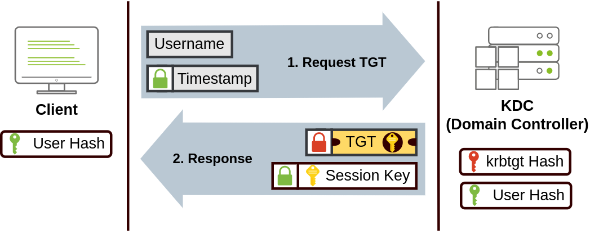

[<- Índice](../SistemasWindows.md)
# Autenticación en Active Directory

> En cuanto a la autenticación, ==todas las credenciales estan almacenadas en el **controlador de dominio**==, de modo que cuando se inicia sesión en cualquier otro dispositivo, lo que pasa realmente es que redirige la autenticación a su **controlador de dominio** y este realiza la verficación correspondiente.

Existen 2 **protocolos** principales para realizar esta autenticación, ***Kerberos*** y ***NetNTLM***.

Aunque ***NetNTLM*** sea considerado obsoleto por algunos, en algunos dominios aun se tienen activas ambas formas de autenticación.

### *Kerberos*

Es el **protocolo de autenticación por defecto** de cualquier versión reciente de *Active Directory*.

Se basa en un sistema de *tickets* que se presentan al servidor dedicado de *Kerberos* y autentican las acciones del usuario.

El proceso que se sigue es aproximadamente el siguiente:

1. El **usuario** envia su nombre de usuario y una marca de tiempo encriptada utilizando el **hash de su contraseña** al servicio ***KDC*** (*Key Distribution Center*). Este servicio es el encargado de crear los ***tickets***.

2. El ***KDC*** crea y devuelve un ***TGT*** (*Ticket Granting Ticket*) y una **llave de sesión** en caso de que la autenticación sea exitosa. Este ***TGT*** es inaccesible para el usuario y dentro incluye otra copia de la **llave de sesión**, pero la **llave de sesión principal** si es desencriptable con el mismo **hash** del paso anterior.

3. Posteriormente, cuando el usuario desea conectarse a un servicio del dominio, solicita un ***TGS*** (*Ticket Granting Service*) al ***KDC*** utilizando el ***TGT*** previo, su **usuario y marca de tiempo** encriptada con la **llave de sesión** y un ***SPN*** (*Service Principal Name*) que es el nombre del servicio reconocido por el ***KDC***.

4. De estar todo correcto, el ***KDC*** devuelve el ***TGS*** para el servicio solicitado encriptado con el **hash del usuario propietario del servicio** ademas de otra **llave de sesión de servicio**, desencriptable con la primera **llave de sesión**. Una vez más, el ***TGS*** es inaccesible y contiene una copia de la nueva **llave de sesión**.

5. Finalmente, el **cliente** envía al servicio el ***TGS*** y su **nombre de usuario** y marca de tiempo encriptados con la **llave de sesión**. De este modo el servicio puede validar el ***TGS*** y los datos del usuario y permitir el acceso.

### *NetNTLM*

Se basa en un mecanismo de **desafío-respuesta** utilizando *hashes* NTLM.

1. El cliente envía una solicitud de autenticación al servidor del que desea un servico o acceso.
2. El servidor genera un número aleatorio y se lo envia como un ***desafío*** al cliente.
3. El cliente combina su propio *hash NTLM* y otra información acordada o configurada en el dominio y la envía como respuesta al servidor para su verificación.
4. El servidor a su vez, solicita al **controlador de dominio** que calcule su propia respuesta con los datos que el posee.
5. Una vez recibidas ambas respuestas, el servidor las verifica, si ambas corresponden el cliente se considera **autenticado** de lo contrario, se le niega el servicio o acceso. 

Destaco en su momento porque no era necesario envíar los *hashes* del usuario a través de la red para llevar a cabo la autenticación.

# Enlaces

[<- Anterior](HFC26_08_2024.md) | [Siguiente ->](HFC29_08_2024.md)