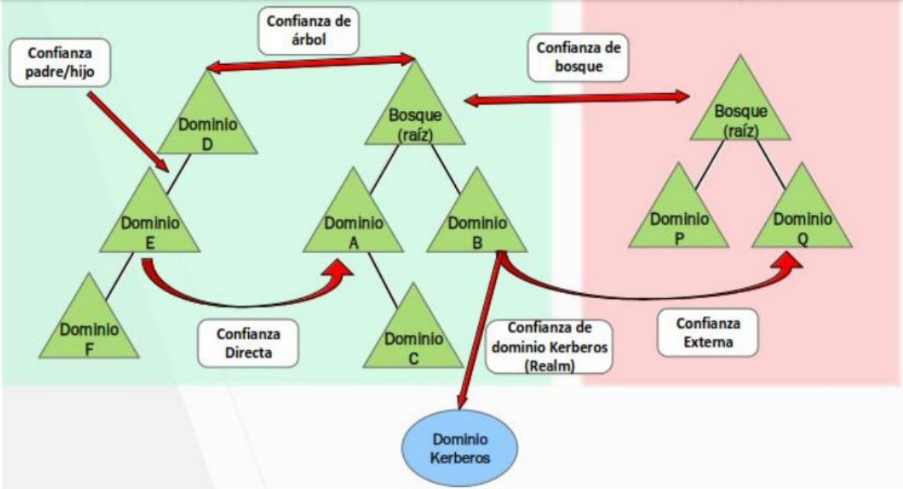

[<- Índice](../SistemasWindows.md)
# Arboles, Bosques y Relaciones de Confianza

Ahora que conocemos la información más importante sobre los dominios de *Active Directory*, podemos introducir una serie de conceptos importantes sobre la organización de dominios.

### Árboles

> Según aumente el tamaño y necesidades de la organización, podríamos necesitar de más de un dominio para la correcta administración de los recursos de esta. En esos casos, *Active Directory* permite la creación de ***subdominios***, cada uno con sus propios usuarios, grupos y políticas, pero accesible para los ***dominios padres*** en caso de que se requiera de su información o recursos. A esta agrupación de dominios se le llama ***Árboles*** y es una de las estructuras más importantes de un *Active Directory* pues es capaz de representar a una organización completa.

Algunas de las ventajas principales de dividir la organización en varios dominios es:

- ***Replicación de datos***: Si se tienen muchisimos recursos y se necesitan distribuir a lo largo de todo el **Árbol**, repartirla entre varios dominios ayuda a la disminución de carga en la red, en lugar de que todos tengan que acceder al mismo dominio para obtener los datos, además de mejorar el tiempo de respuesta para el equipo solicitante.

- ***Mejor organización***: Podemos segmentar de mejor manera las áreas de la organización y otorgar los permisos e información adecuadas para estas.

- ***Autonomía admnistrativa***: Proporciona control sobre sus recursos a cada dominio, mejorando la gestión y el rol de cada dominio, pero con el apoyo de un **dominio padre** cuando este lo necesite.

Estas estructuras dan lugar a un nuevo rol en la organización, ***Enterprise Admins*** que son usuarios con privilegios sobre todo el **Árbol**, aun por encima de cada ***Domain Admin*** en la organización.
 
### Bosques

> Llendonos aún más allá de los **Árboles**, por ejemplo, cuando una empresa adquiere otra, es poco probable que decida adecuar todo el sistema administrativo bajo su propio **Árbol**, pues es impráctico, complejo y tedioso. La idea entonces, es simplemente ==relacionar== ambos **Árboles** respetando sus respectivas administraciones, de ahi nace el concepto de ***Bosque***, como la relación de varios **Árboles**.

De igual manera, la organización mediante distintos **Árboles** es beneficiosa porque brinda:

- ***Aislamiento administrativo***: En este caso, los **Árboles** son completamente independientes pues no se adecuan o integran bajo la administración de los otros **Árboles**. Una cualidad muy beneficiosa cuando cada **Árbol** trata con recursos completamente distintos.
- ***Distintos enfoques administrativos***: Según lo necesite, cada **Árbol** puede implementar su propio enfoque **administrativo** sin perjudicar a los demás

### Relaciones de Confianza

Antes, ya hemos hablado de **relacionar** árboles y dominios, existe una definición formal de esto denominada ***Relaciones de Confianza***.

> Las ***Relaciones de Confianza*** son un mecanismo de ==autorización de acceso sobre recursos de distintos dominios==. Poseen el objetivo de facilitar las interacciones entre estos sin necesidad de intermediarios o autenticaciones complejas.

Poseen principalmente 2 propiedades:

- ***Transitividad***: Al establecer una **relación de confianza transitiva** de un dominio A hacia un dominio B, estamos automáticamente aceptando una relación de confianza con todos los dominios en los que confia B.
- ***Dirección***: Las relaciones de confianza pueden ser **unidireccionales** o **bidireccionales**. En caso de ser unidireccionales, debemos establecer que dominio confia en quien, es decir, que dominio confia sus recursos a quien.

Entonces, existen varios tipos principales de ***Relaciones de Confianza***.

##### Relaciones de Confianza de Bosque
Típicamente, es una relación de confianza entre **Controladores de Dominio de algún árbol** entre 2 **Bosques distintos**. Es una relación **no-transitiva** y pueden ser **unidireccionales o bidireccionales** según se necesite.

##### Relaciones de Confianza de Árbol
Es la relación de confianza entre los **Controladores de Dominio principales** de 2 Árboles distintos, con este tipo de relaciones nace un Bosque. Esta relación es **transitiva** y **bidireccional**.

##### Relacion de Confianza Padre-Hijo
Se crea automáticamente entre 2 dominios directamente relacionados de un Árbol, es decir, un **dominio padre** y un **subdominio**. Es una relación de confianza **transitiva** y **bidireccional**.

##### Relaciones de Confianza de Acceso Directo (Shortcut)
Es una **Relación de Confianza** entre cualesquiera 2 dominios de un mismo **Bosque** que no esten relacionados directamente, usualmente son configuradas con el objetivo de agilizar la comunicación entre ellos, desechando la necesidad de dirigir la comunicación a través de todos los dominios intermedios.

##### Relaciones de Confianza Externas
Es una **Relación de Confianza** entre cualesquiera 2 dominios de bosques distintos donde no se ha establecido una **Relación de confianza de bosque** entre ellos. No suele ser **transitiva** y puede ser **unidireccional** o **bidireccional**.

##### Relaciones de Confianza de Dominio Kerberos
Es una **Relación de Confianza** entre cualquier dominio de un *Active Directory* y un dominio de *Kerberos*, usualmente con el objetivo de incluir los servicios de *Kerberos* en el *AD*. Estas relaciones se necesitan pues *Kerberos* se implementa con un servicio de directorio distinto a *Active Directory* por lo que este último lo considera externo a su dominio.

# Enlaces

[<- Anterior](HFC28_08_2024.md) | [Siguiente ->](HFC30_08_2024.md)