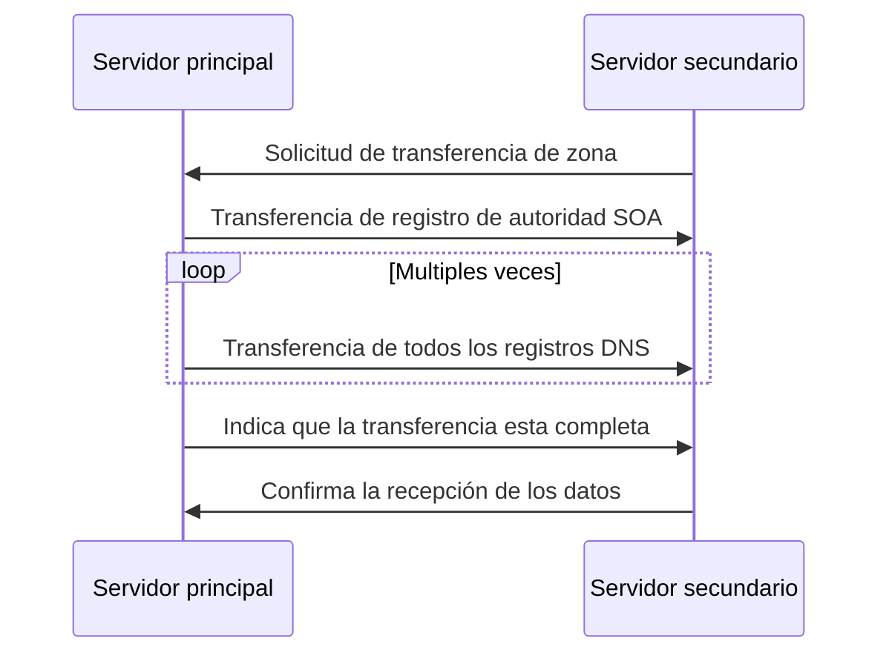

[<- Índice](../WebHacking.md)
# DNS

El funcionamiento y conceptos básicos del protocolo **DNS** puede encontrarse a detalle en esta [nota](../../RedesComputadora/apuntes/Redes_dns.md) de la sección de **Redes de Computadora**, de modo que obviaré su explicación en este apartado.

#### ¿Por qué nos importa el DNS para reconocimiento web?

Entender y enumerar el *DNS* de una organización puede brindarnos un entendimiento básico de su infraestructura e incluso revelar información sensible que nos guie a descubrir vulnerabilidades o puntos débiles, como:

- ***Descubrir recursos***: Los **registros** *DNS* son una fuente valiosa de información en la que podríamos descubir subdominios, alias, servidores de correos, servidores *DNS* autoritativos e incluso algunos correos de administradores.

- ***Mapear la infraestructura de red***: Podemos identificar varios componentes de la infreastructura en base a los registros o los nombres de dominio que poseen.

- ***Monitoreo de cambios***: Al analizar continuamente la información en un servidor *DNS*, podríamos notar cambios importantes en la infraestructura u organización. De modo que podríamos aprovechar dichos cambios a nuestro favor.

## Herramientas

Para el reconocimiento *DNS*, existen muchas implementaciones de herramientas que ayudan en gran medida a este propósito, mediante consultas *DNS* personalizadas.

Algunas de las más conocidas son:

| Herramienta                           | Descripción                                                                                                                                                                                                                    |
| ------------------------------------- | ------------------------------------------------------------------------------------------------------------------------------------------------------------------------------------------------------------------------------ |
| `dig`                                 | Herramienta altamente versatil para realizar consultas *DNS* personalizadas y con obtener información detallada.                                                                                                               |
| `nslookup`                            | Herramienta simple para consultas *DNS* básicas, principalmente para registros **A**, **AAAA** y **MX**.                                                                                                                       |
| `host`                                | Herramienta muy simple preinstalada en sistemas *UNIX* que brinda información concisa, únicamente para registros **A**, **AAAA** y **MX**.                                                                                     |
| `dnsenum`                             | Herramienta de enumeración automática principalmente enfocada en fuerza bruta, ataques de diccionario y transferencias de zona sobre servidores *DNS*.                                                                         |
| `fierce`                              | Herramienta de enumeración de subdominios a partir de consultas recursivas y detección de comodines, conocida tambien por su interfaz amigable.                                                                                |
| `dnsrecon`                            | Herramienta que integra varias técnicas conocidas de enumeración *DNS* y soporta varios formatos de salida, usualmente utilizada para extraer información de los registros y para enumeración de subdominios.                  |
| `theHarvester`                        | Herramienta *OSINT* que recolecta información de muchas fuentes públicas acerca del nombre de dominio, incluyendo por supuesto los registros DNS. Incluso puede descubrir correos electrónicos, información de empleados, etc. |
| ***Páginas de consultas DNS online*** | Páginas con interfaces amigables que permiten realizar consultas *DNS* básicas y avanzadas.                                                                                                                                    |

### Dig

> La utilidad **Dig** es una herramienta poderosa y versatil para realizar consultas *DNS* y recuperar varios tipos de información en los registros. Es **flexible**, **personalizable** y permite filtrar los resultados de forma avanzada.

Es una herramienta con muchisimas opciones pero mayormente estaremos utilizando una sintaxis de la siguiente manera:

- `dig <Registro> <IP> @<ServidorDNS>`

El orden de estos parametros no es obligatorio y podemos indicarlo como nos convenga.

Algunas de las formas más comunes de utilizar esta herramienta son:

| Comando                         | Descripción                                                                                                                                                                                      |
| ------------------------------- | ------------------------------------------------------------------------------------------------------------------------------------------------------------------------------------------------ |
| `dig domain.com`                | Realiza una consulta de registro *A* para el dominio especificado, recuperando la dirección IP.                                                                                                  |
| `dig aaaa domain.com`           | Realiza una consulta del registro especificado (AAAA) del dominio indicado.                                                                                                                      |
| `dig domain.com CNAME`          | Realiza una consulta de registro CNAME del dominio especificado.                                                                                                                                 |
| `dig @1.1.1.1 domain.com`       | Realiza una consulta por defecto (A) especificamente al servidor `1.1.1.1` del dominio indicado.                                                                                                 |
| `dig +trace domain.com`         | Indica el camino completo que realiza la consulta por defecto del dominio indicado.                                                                                                              |
| `dig -x 8.8.8.8`                | Realiza una consulta inversa de la dirección IP especificada, recuperando su nombre de dominio si es que tiene.                                                                                  |
| `dig +short domain.com`         | Realiza una consulta por defecto del dominio y brinda una respuesta más concisa y breve.                                                                                                         |
| `dig +noall +answer domain.com` | Realiza una consulta por defecto del dominio e imprime únicamente la respuesta en pantalla.                                                                                                      |
| `dig any domain.com`            | Devuelve todos los registros del dominio indicado. Sin embargo, actualmente la gran mayoría de servidores *DNS* ignoran este tipo de consultas para prevenir abusos y reducir el tráfico de red. |

#### Salida

La salida de esta herramienta esta bastante completa y posee varias secciones importantes que vamos a desglosar, suponiendo que ejecutamos `dig google.com`:

1. ***Encabezado*** (*HEADER*)
	- `;; ->>HEADER<<- opcode: QUERY, status: NOERROR, id: 34056`
		- Esta es la línea principal del encabezado e indica el tipo de consulta `opcode: QUERY`, el estado de la consulta `status: NOERROR` y el identificador único asignado a la consulta `34056`.

	- `;; flags: qr rd ad; QUERY: 1, ANSWER: 1, AUTHORITY: 0, ADDITIONAL: 1`
		- Esta línea indica las banderas en el encabezado de la respuesta *DNS*
		- `qr` (*Query Response flag*): Indica que si hubo una respuesta a la solicitud.
		- `rd` (*Recursion Desired flag*): Indica que se solicituo la recursión de la consulta.
		- `ad` (*Authentic Data flag*): Significa que el servidor *Resolver* considera que la información es auténtica.
		- El resto de los **números** indica el numero de entradas en cada sección de la respuesta: 1 Consulta, 1 Respuesta, 0 registros de autoridad (*SOA*) y 0 entradas adicionales.

2. ***Consulta*** (*QUESTION SECTION*)
	- Indica la información que se solicitó, para nuestro ejemplo, sería: `;google.com. IN A`

3. ***Respuesta*** (*ANSWER SECTION*)
	- Indica el resultado de nuestra consulta en el formato tradicional: `google.com. 31 IN A 142.251.218.142`
	- El **número** indica el **TTL** (*Time to live*) de esta información, es decir cuanto tiempo podemos almacenar este resultado en caché, sin tener que realizar otra consulta recursiva.
	- Dependiendo de la consulta, podriamos obtener más respuestas que no fueron directamente solicitas en la sección **adicional** de la salida.

4. ***Pie de página***
	- Incluye información adicional sobre la consulta realizada, por ejemplo:
		- `;; Query time: 7 msec`: El tiempo que tomo el proceso de la consulta y la obtención de la respuesta.
		- `;; SERVER: 192.168.100.1#53(192.168.100.1) (UDP)`: El **servidor** *DNS* que respondió nuestra consulta y el protocolo utilizado (*UDP*)
		- `;; WHEN: Mon May 19 12:01:06 CST 2025`: Marca de tiempo cuando se originó la consulta.
		- `;; MSG SIZE  rcvd: 55`: El tamaño de la respuesta obtenida.

Toda esta información sin duda es útil para la enumeración.
Sin embargo, para obtener **únicamente** la respuesta a nuestra consulta, sin la sintaxis tradicional, podemos indicar *+short*, por ejemplo:

```bash
dig +short hackthebox.com

# 104.18.20.126
# 104.18.21.126
```
# Subdominios

En la sección anterior, cuando explorabamos los **registros** *DNS*, nos enfocabamos principalmente en el dominio principal de la organización y la información relacionada con este.

Sin embargo, aunado al dominio principal, posiblemente existe toda una red de subdominios en la organización que pueden ser clave en la enumeración.

> Un **subdominio** no es mas que una **extensión** del dominio principal, usualmente creado para organizar y segmentar distintas secciones o funciones dentro de la organización o incluso dentro de un sitio web.

Por ejemplo, podrían existir subdominios relevantes como `blog.example.com`, `shop.example.com` y `mail.example.com`, con claras referencias a sus funcionalidades.

#### ¿Porque son importantes para el reconocimiento web?

- ***Podrían descubrirse sitios web en desarrollo o bajo prueba***: Muchas veces, se utilizan subdominios de la organización para poner a prueba nuevas actualizaciones, funcionalidades o secciones antes de desplegarlas en el sitio principal. En estos podríamos encontrar vulnerabilidades o información sensible.

- ***Portales de inicio de sesión escondidos***: A veces se pretende ocultar paneles administrativos o páginas de inicio de sesión en subdominios poco utilizados de la organización, lo que los vuelve objetivos atractivos.

- ***Aplicaciones o sitios de legado***: Incluso podríamos llegar a descubir versiones obsoletas o hasta olvidadas de aplicaciones *web* y demás funciones de la organización, potencialmente con vulnerabilidades conocidas o funciones administrativas mal configuradas.

- ***Información sensible***: En general, cualquier sitio alojado en subdominios es una fuente más de información de la organización, que podría contener cualquier tipo de **información sensible** que podríamos aprovechar en nuestra auditoría.

## Enumeración de subdominios

> Se refiere al proceso **sistemático** de identificar y listar estos subdominios pertinentes a la organización. Al igual que el reconocimiento, posee los mismos 2 enfoques principales:

#### Enumeración de subdominios activa

Consiste en la interacción directa con servidores *DNS* de la organización con la intención de descubrir estos subdominios.

Uno de los métodos más conocidos es la **transferencia de zonas DNS**, si es que el servidor esta malconfigurado y las permite, pero en la actualidad es cada vez más raro que suceda gracias a la mejora general de seguridad en este tipo de servidores.

Un método mucho más común y fructífero es la **enumeración por fuerza bruta**, que consiste en realizar muchas solicitudes al servidor con nombres probables de subdominios e identificar respuestas afirmativas para determinar la existencia del subdominio.

Existen herramientas que automatizan este método mediante el uso de diccionarios,  como lo son `dnsenum`, `ffuf`, `gobuster`, etc.

#### Enumeración de subdominios pasiva

Este tipo de **enumeración** se basa en fuentes externas y públicas de información para determinar subdominios sin la necesidad de interactuar directamente con los sistemas del objetivo.

Por ejemplo, uno de los recursos más valiosos son los **registros** de **Transparencia de Certificados** (*CT Logs*), que son repositorios públicos de información acerca de certificados *SSL/TLS* expedidos y reconocidos oficialmente.
Al registrar un nuevo subdominio para la organización, es común procurar que este posea certificado *SSL/TLS* para garantizar su autenticidad y descartar posibles ataques **MITM** (*Man in the Middle*), pero al obtener un nuevo certificado para el subdominio, el nombre y la información del subdominio es almacenada en este tipo de registros, disponibles al público general.

Otro buen método **pasivo** es el uso de **motores de busqueda** como *Google* o *DuckDuckGo* utilizando filtros avanzados para identificar subdominios relacionados a un dominio principal específico.
Por ejemplo, los *Google Dorks* con la etiqueta `site:`.

Y en general, existen muchas herramientas y páginas especializadas principalmente en la enumeración de subdominios gracias a muchisimas fuentes públicas de información, que facilitan bastante este tipo de enumeración.

---

### Enumeración de subdominios por fuerza bruta

Antes, se mencionó la idea general de este tipo de enumeración pero desglosar a detalle este proceso como los siguientes pasos:

1. ***Selección de un diccionario***. Este proceso inicia al seleccionar el diccionario adecuado para nuestro objetivo, que pueden ser:

	- **De proposito general**: Contienen una gran cantidad de nombres **comunes** de subdominios sin ninguna tendencia en específico, por ejemplo `dev`, `staging`, `blog`, `admin`, etc.
	
	- **Enfocados**: Son diccionarios principalmente centrados en industrias, tecnologías o patrones específicos que se relacionen con nuestro objetivo, pero aun con cierto grado de generalidad.
	
	- **Personalizado**: Son diccionarios creados manualmente por nosotros totalmente basados en palabras clave, patrones o información de nuestro objetivo, siendo totalmente específicos.

2. ***Iteración y construcción***: Mediante cualquier herramienta o *script* buscamos iterar a través del diccionario seleccionado y concatenar el nombre que deseamos probar con el dominio principal de la organización. Creando así los nombres de dominio que realmente vamos a consultar como `dev.example.com` o `staging.example.com`

3. ***Consulta DNS***: Se realiza una consulta *DNS* **formal** con cada uno de los nombres creados anteriormente, típicamente a registros **A** o **AAAA**.

4. ***Filtrado y validación***: Si el subdominio consultado es resuelto correctamente, o sea si obtuvimos una respuesta *DNS*, es considera un subdominio **valido** y se realizan posteriores pruebas de validación para confirmar su existencia y funcionalidad, por ejemplo, consultandolo desde nuestro navegador.

Algunas de las herramientas más famosas para este tipo de enumeración son:

#### `dnsrecon`

Es un *script* de **Python** bastante actualizado enfocado a las auditorias de *DNS* que, entre otras cosas, permite:

- Revisar si alguno de los **servidores DNS** en registros **NS** permite las **transferencias de zona**
- Enumerar en general varios **registros DNS** del dominio (MX, SOA, NS, A, AAAA, etc)
- Enumeración avanzada de resitros **SRV**
- Fuerza bruta para enumeración de subdominios
- Consultas inversas (PTR) para un rango específico de direcciones IP

Algunas de las formas más importantes de utilizar esta herramienta son las siguientes.

###### Fuerza bruta

Necesitamos especificar el **tipo** de enumeración `brt` con la bandera `-t`, indicar el dominio objetivo con `-d` y finalmente nuestro diccionario con `-D`.

```bash
dnsrecon -t brt -d inlanefreight.com -D /usr/share/seclists/Discovery/DNS/subdomains-top1million-20000.txt
```

Opcionalmente, podemos indicar un servidor *DNS* especifico al que realizar las consultas directamente con la bandera `-n`.

###### Transferencias de zona

En esta ocasión solo debemos especificar el **tipo** de enumeración `axfr` y el dominio objetivo.
La herramienta por si sola consultará los servidores en el registro **NS**, solicitará una **transferencia de zona** sobre cada uno e indicara para cada caso si alguno fue exitoso o no.

```bash
dnsrecon -t axfr -d inlanefreight.com
```

###### Consulta de registros CT (Certificate Transparency)

Hablando de una técnica más pasiva, esta herramienta puede consultar la página `crt.sh`, un conocido **registro** de transparencia de certificados, para determinar subdominios registrados en esta.

Nuevamente, solo debemos indicar el **tipo** de enumeración `crt` y el dominio objetivo.

```bash
dnsrecon -t crt -d inlanefreight.com
```

#### `dnsenum`

Es una herramienta escrita en **Perl** un poco obsoleta pero también fácil de utilizar, y su funcionalidad se mantiene vigente hasta hoy.
Permite:

- Enumeración de registros **DNS**
- Solicitar transferencias de zona
- Fuerza bruta sobre subdominios
- **Google Scraping**: Realizar busquedas en *Google* avanzadas para descubir subdominios
- **Consultas DNS inversas**: Intenta determinar el nombre de dominio relacionado a una dirección IP
- Consultas WHOIS

La forma más facil de utilizarla es con la bandera `--enum`, un modo que realiza varios tipos de enumeraciones de una sola vez:

```bash
dnsenum --enum -f /usr/share/seclists/Discovery/DNS/subdomains-top1million-20000.txt inlanefreight.com
```

El diccionario se especifica con la bandera `-f` y al final el dominio objetivo.

---

### Transferencias de Zona (AXFR)

Llevamos un rato hablando de **Transferencias de Zona**, pero ¿qué son realmente?

> Una **transferencia de zona** es esencialmente solicitar una copia completa de todos los **registros DNS** configurados en la zona solicitada. Principalmente, es un mecanismo para replicar la información entre servidores *DNS*, para disponer de respaldos de estas zonas en caso de que alguno falle.

Mientras que realizar **fuerza bruta** para determinar subdominios puede brindar información rapidamente, una **transferencia de zona** es menos invasiva y tiene el potencial de ser más eficiente para descubrir subdominios, si se logra.

Una **transferencia de zona** consiste principalmente en:



#### Vulnerabilidad

Mientras que las **transferencias de zona** son una forma legítima de administración de servidores *DNS*, si se configura negligentemente representa una brecha de seguridad importante, pues filtra información confidencial de la organización.

Esto ocurre cuando se permite a cualquier cliente *DNS* solicitar **transferencias de zona** del servidor *DNS*, lo que les brinda una copia completa de toda la configuración *DNS*.

Principalmente filtrando **subdominios**, **direcciones IP** y **Registros de servidores DNS autoritativos**.

##### Remediación

En servidores **DNS** modernos, se configura que las **transferencias de zona** solo se permitan a un conjunto reducido de servidores **DNS** secundarios de confianza.

Sin embargo, los errores en esta configuración siempre son posibles y no es mala práctica intentar solicitar una **transferencia de zona** como una técnica de reconocimiento.

#### Solicitar una transferencia de zona

> Podemos solicitar de forma sencilla una transferencia de zona mediante la heramienta `dig`, indicando la palabra clave `axfr` y el servidor *DNS* adecuadamente.

Además, se debe indicar el dominio cuya zona **completa** queremos transferir, típicamente el dominio principal de la organización, aunque a veces puede ser un subdominio específico.

```bash
dig axfr dominio.com @servidor.dns
```

Por ejemplo, para transferir **toda** la zona del dominio `inlanefreight.htb`, del servidor **DNS** *10.129.215.170*, ejecutariamos:

```bash
dig axfr inlanefreight.htb @10.129.215.170
```

# Enlaces

[<- WHOIS](web_whois.md) | [Crawling ->](web_crawling.md)