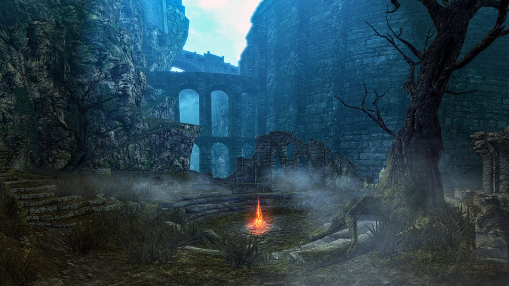

[PENDIENTES](TODO.md)

## Agrupación

- [Hacking Fight Club](HFC/HackingFightClub.md)

## Materias

- Cuarto semestre
	- [Logica Computacional](LogicaC/LogicaComputacional.md)
	- [Arquitectura de Computadoras](ArquiC/ArquitecturaDeComputadoras.md)
	
- Quinto semestre
	- [Analisis de Algoritmos](AnalisisAlgoritmos/AnalisisAlgoritmos.md)
	- [Lenguajes de Programación](LenguajesProgramacion/LenguajesProgramacion.md)
	- [Computación Distribuida](ComputacionDistribuida/ComputacionDistrubuida.md)

- Sexto semestre
	- [Inteligencia Artificial](InteligenciaArtificial/InteligenciaArtificial.md)
	
- Optativas
	- [Introducción al Internet of Things (IoT)](IoT/InternetOfThings.md) 