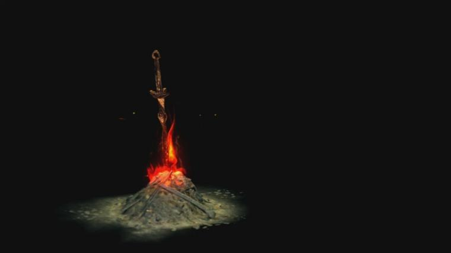

 [<- Indice de materias](../IndiceDeMaterias.md)

Notas:

1. [Introducción](apuntes/Introduccion.md)
2. [Dispositivos del Internet de las Cosas](apuntes/DispositivosInternetDeLasCosas.md)
3. [Códigos de Señales Digitales y Analógicas](apuntes/CodigosSeñalesDigitalesYAnalogicas.md)
---
4. [Conectividad](apuntes/Conectividad.md)
5. [Codigos de Conectividad](apuntes/CodigosConectividad.md)
---
6. [Protocolos de Mensajeria HTTP](apuntes/ProtocolosDeMensajeria_HTTP.md)
7. [SPIFFS](apuntes/SPIFFS.md)
8. [Códigos basicos de HTTP](apuntes/CodigosbasicosHTTP.md)
9. [Códigos Avanzados de HTTP](apuntes/CodigosAvanzadosHTTP.md)
---
10. [Protocolos de Mensajeria MQTT](apuntes/ProtocolosDeMensajeria_MQTT.md)
11. [Códigos MQTT](apuntes/CodigosMQTT.md)
---
12. [Ciberseguridad](apuntes/Ciberseguridad.md)
13. [Codigos AES](apuntes/CodigosAES.md)
---
14. [Almacenamiento](apuntes/Almacenamiento.md)
15. [Alarmas y Control](apuntes/AlarmasYControl.md)
16. [Códigos de Control PID](apuntes/CodigosControlPID.md)
---
17. [Bots](apuntes/Bots.md)
18. [Códigos Bots](apuntes/CodigosBots.md)