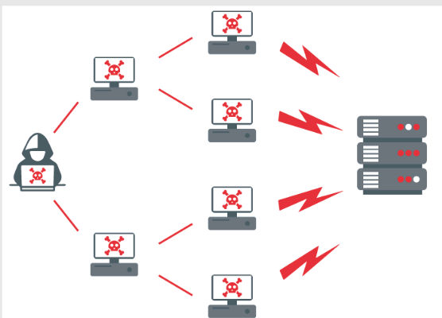
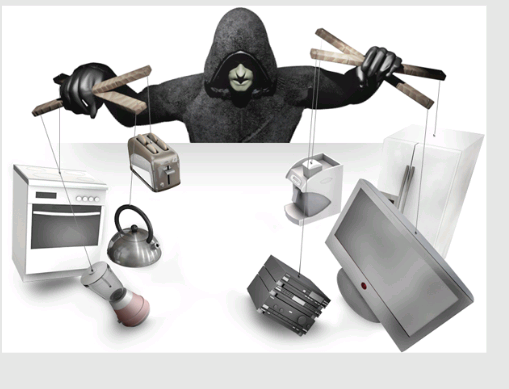
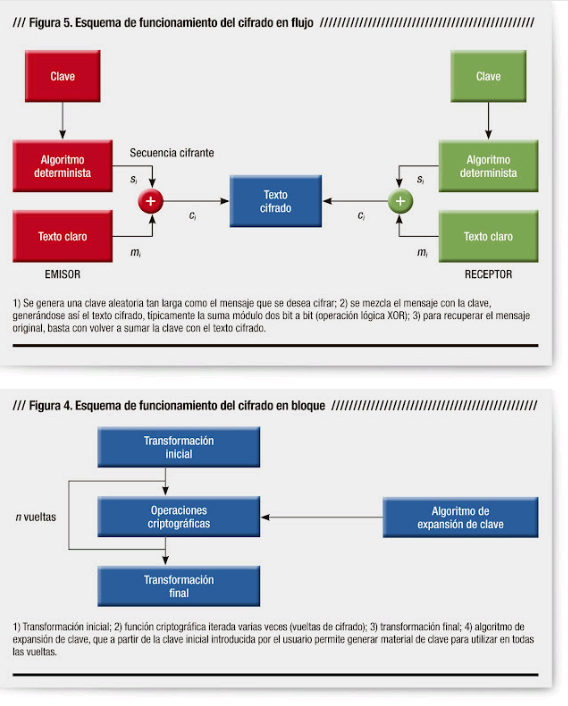
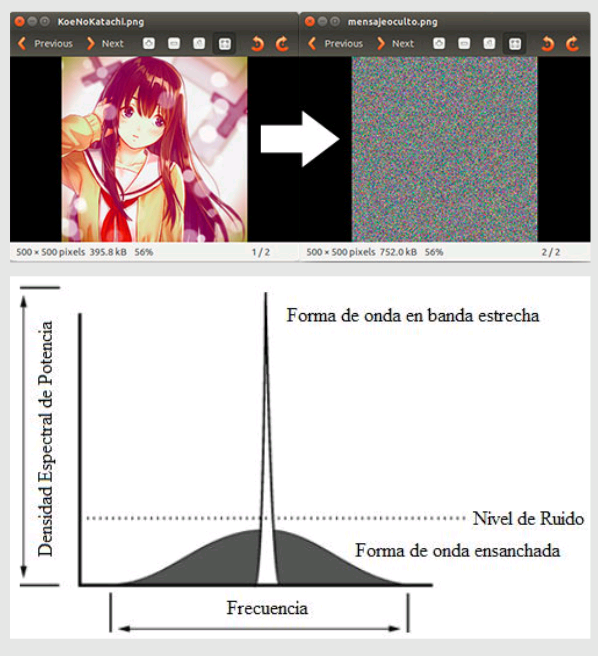
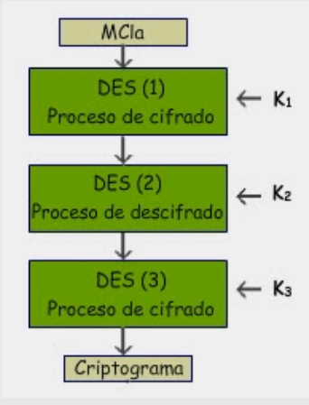
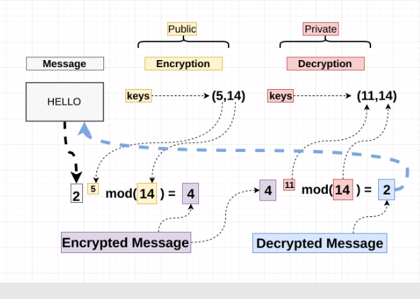
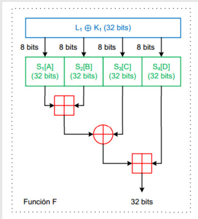

[<- Índice](../InternetOfThings.md)
## Ciberseguridad y ataques cibernéticos

Un **ataque cibernético** es cuando un individuo o una organización intenta deliberada y maliciosamente violar el sistema de información de otro individuo u organización. Si bien suele haber un objetivo económico, algunos ataques recientes muestran la destrucción de datos como un objetivo.

La **ciberseguridad** es la encargada de evitar dichos ataques.

## Tipos de ataques

- *Malware*

- *Phishing*

- MitM

- DOS

- Inyecciones SQL

- Explotación de día cero

- Ataque de contraseña

- Secuencia de comandos entre sitios

- ***Ataques IoT***

## Ciberataques en IoT

¿El IoT es un campo vulnerable para los ataques cibernéticos?

> ***Si***

#### Ataques sucedidos

- DOS a Dyn (2016)
- Casino (2018)

#### Prevenciones

##### Software

- Mantener actualizadas las aplicaciones y antivirus
- Incorporar canales seguros de comunicación
- Credenciales de inicio de sesión seguros
- Usar conexiones VPN seguras
- Uso de la Computación en la Nube para resguardar información y establecer la conectividad de los distintos dispositivos de IoT
- Aseguramiento de copias de seguridad de archivos, datos y sistema operativo

##### Hardware

- Evitar accesos no autorizados a los dispositivos
- Desactivación del *Universal Plug and Play*
- Protección de interfaces tales como *USB* y *JTAG*
- Concientizar al personal de trabajo acerca de los riesgos inherentes

## Encriptación

La encriptación de datos es el proceso de cifrado de información que permite proteger los documentos, mensajes, base de datos y referencias vulnerables (como información personal) para que terceros no accedan a ellos de manera ilegal.

#### Métodos

- Según claves
	- Encriptación simétrica
	- Encriptación asimétrica
	- Encriptación mixta

- Según algoritmos
	- Encriptación en flujo
	- Encriptación por bloques

- Sistemas alternativos
	- Esteganografía
	- Spread-Spectrum

#### Algortimos

- AES

- DES

- 3DES

- RSA

- ECC

- Blowfish

#### Empresas

- ==Archivos locales y/o en la nube==
	- Cryptomator
	- AES Crypt
	- File Lock PEA
	- AxCrypt
	- GNUPG
- ==Correo electrónico (*CERN*)==
	- BoxCryptor
- ==Navegación WEB==
	- HTTPS Everywhere

# Enlaces

[<- Anterior](CodigosMQTT.md) | [Siguiente ->](CodigosAES.md)