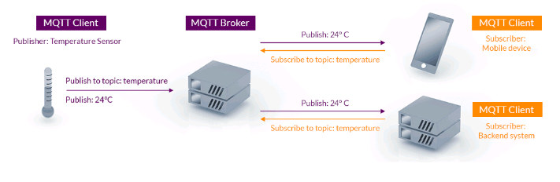

[<- Índice](../Internet%20of%20Things%20(IoT).md)

## Protocolos de mensajería

- **MQTT**
- **HTTP**
- AMQP
- WAMP
- CoAP
- STOMP
- XMPP (*Whatssap y Messenger*)
- WMQ

## MQTT

*Messafe Queue Telemetry Transport* (MQTT) es un protocolo de pub-sub simple y ligero, diseñado principalmente para mensajería en redes y dispositivos restringidos. Proporciona una distribución de mensajes de uno a muchos y es independiente del contenido de la carga útil.

#### Brokers

Los *Brokers* son intermediarios entre los *clientes MQTT* y los *suscritores MQTT* pudiendo filtrar los mensajes enviados por temas.

#### ESP32

El *broker* que utiliza el *ESP32* es *Mosquitto*

# Enlaces

[<- Anterior](Codigos%20avanzados%20HTTP.md) | [Siguiente ->](Codigos%20MQTT.md)