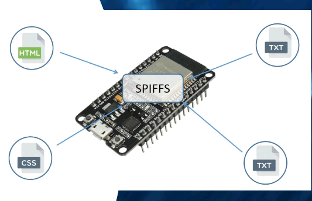
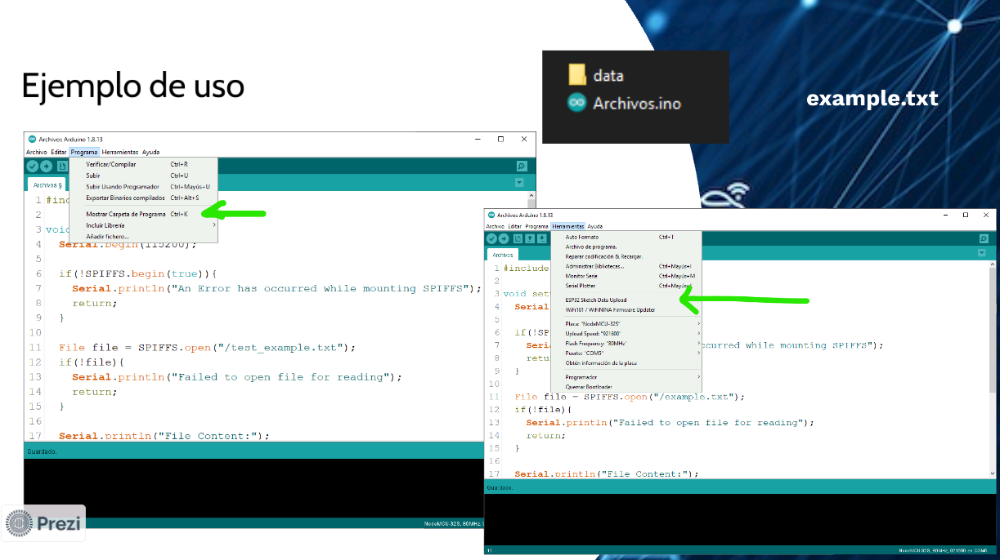

[<- Índice](../Internet%20of%20Things%20(IoT).md)

## ¿Qué es?

El *ESP32* contiene un sistema de archivos flash de interfaz periférica en serie (SPIFFS).

Es un sistema de archivos liviano creado para microcontroladores con un chip flash, que están conectados por bus *SPI*, como la memoria flash *ESP32*.

## Ejemplo

Los archivos que utilizaremos se deben almacenar en una carpeta llamda `data`.

# Enlaces

[<- Anterior](Protocolos%20de%20mensajeria%20(HTTP).md) | [Siguiente ->](Codigos%20b%C3%A1sicos%20HTTP.md)