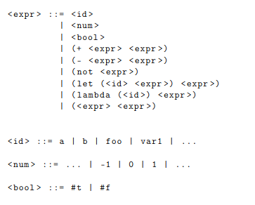

[<- Índice](../LenguajesProgramacion.md)
# Expresiones $\lambda$ en *MiniLisp*

Para estudiar estos conceptos se extiende *MiniLisp* para que soporte funciones *lambda*:

Ahora es posible definir funciones, por ejemplo, la identidad:

> `(lambda (x) x)`

Entonces ahora debemos abordar una serie de conceptos fundamentales sobre funciones:

## Taxonomía de funciones

Las funciones en *MiniLisp* se definen de igual manera que en el Cálculo $\lambda$, es decir, una función puede crear otras funciones, pueden usarse como cualquier otro valor en el lenguaje; sin embargo, es importante recalcar que no todos los lenguajes de programación ofrecen estas capacidades (*Java*, *C*, *Fortran*, etc).

De esta forma, existe una taxonomía que permite clasificar a las funciones de acuerdo a su comportamiento en un lenguaje:

### Funciones de Primera Clase

Son funciones que pueden ser tratadas como valores dentro del lenguaje.

- Pueden ser asignadas a variables
- Pueden ser usadas como argumentos a otras funciones
- Pueden ser devueltas como resultados de funciones

Algunos ejemplos de lenguajes con funciones de primera clase son *Python* y *Haskell*.

### Funciones de Orden Superior

Son funciones que reciben otras funciones como argumentos o devuelven funciones como resultado.

- Pueden manipular otras funciones
- Pueden ser usadas con esquemas recursivos como `map`, `fold`, `filter`, etc.

De nuevo, *Python* y *Haskell* incluyen este tipo de funciones.

### Funciones de Primer Orden

Son funciones que no toman otras funciones como argumentos ni devuelven funciones como resultados

- Solo operan sobre valores (números, cadenas, etc)
- No permiten abstracciones complejas sobre otras funciones.

Lenguajes con este tipo de funciones son *Java* y *C*.

---

## Sintaxis abstracta

Extendemos nuestras reglas de definición de *ASA*s con los siguientes 2 nuevos constructores:

**Funciones**:
$$
\begin{prooftree}
\AxiomC{$p$ : \texttt{String}}
\AxiomC{$c$ \texttt{ASA}}
\BinaryInfC{$Func(p,c)$ \texttt{ASA}}
\end{prooftree}
$$

**Aplicaciones de función**:
$$
\begin{prooftree}
\AxiomC{$f$ \texttt{ASA}}
\AxiomC{$a$ \texttt{ASA}}
\BinaryInfC{$App(f,a)$ \texttt{ASA}}
\end{prooftree}
$$

## Semántica

### Sustitución

Antes de definir formalmente la semántica de las funciones, debemos actualizar nuestro algoritmo de sustitución para considerar los casos para los nuevos constructores:

**Funciones**:
Al igual que un *let*, debemos cuidar el alcance del parámetro de la función

Si $x=p$
$$
Fun(p,c)[x:=e] \quad = \quad Fun(p,c)
$$

Si $x \neq p$:
$$
Fun(p,c)[x:=e]=Fun(p,c[x:=e])
$$

**Aplicaciones de función**:
Basta con realizar recursivamente la sustitución:
$$
App(f,a)[x:=e] \quad = \quad App(f[x:=e], \; a[x:=e])
$$

### Semántica natural

Las reglas de semántica de paso grande se definen de la siguiente manera:
$$
\begin{prooftree}
\AxiomC{}
\UnaryInfC{$Fun(p,c) \Rightarrow Fun(p,c)$}
\end{prooftree}
$$

$$
\begin{prooftree}
\AxiomC{$f \Rightarrow Fun(p,c)$}
\AxiomC{$a \Rightarrow a_v$}
\AxiomC{$c[p:=a_v] \Rightarrow c_v$}
\TrinaryInfC{$App(f,a) \Rightarrow c_v$}
\end{prooftree}
$$

## Azúcar sintáctica

Podemos notar que la evaluación de las expresiones `let` y de las aplicaciones de función presentan un comportamiento demasiado similar.

Entonces de aquí en adelante, proponemos eliminar la primitiva expresión *let* y realizar las conversiones correspondientes a *lambdas* donde se requieran.

# Enlaces

[<- Anterior](LP09_09_2024.md) | [Siguiente ->](LPNota15.md)