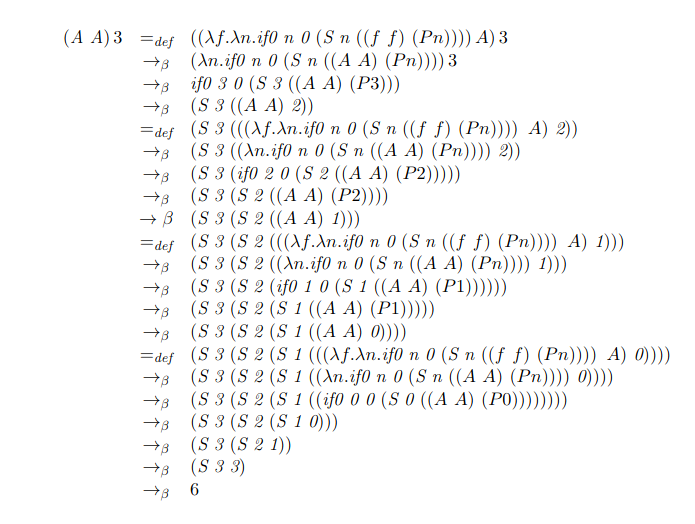
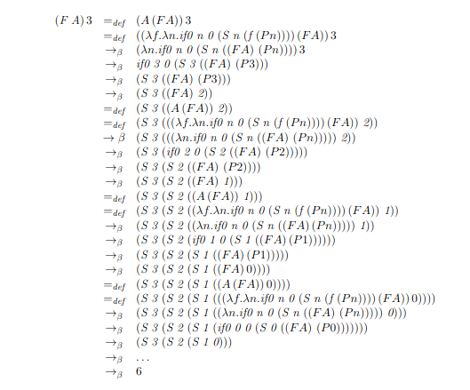

[<- Índice](../LenguajesProgramacion.md)
# Combinadores de Punto FIjo

> Un ==**combinador**== es una expresión cerrada, es decir, no tiene variables libres.

Por otro lado, se dice que $x$ es un ==punto fijo== de $f$ si $x = f(x)$.

De esta forma, en el Cálculo $\lambda$ existen una serie de combinadores que reciben como parámetros una función y devuelven como resultado el punto fijo de la misma.

A estos combinadores se les da el nombre de ***combinadores de punto fijo***.

Son herramientas fundamentales en la teoría de lenguajes de programación pues, ==permiten definir funciones recursivas== sin necesidad de referirse ellas directamente por medio de un nombre.

Es una especie de **truco** matemático que permite que una función se siga llamando a sí misma, pero sin tener un nombre explícito para hacerlo.

### Suma de los primeros n números naturales

Podemos definir dentro del cálculo $\lambda$ una función que sume los primeros números naturales como sigue:

$$
\lambda n. \; if0 \; n \; 0 \; (S \; n (f \; (Pn)))
$$

Al tratar de usar esta definición, notamos que f es una variable libre, lo cual representa un problema pues bloquea las derivaciones sin llegar al resultado esperado.

Por ejemplo:

$$
(\lambda n. \; if0 \; n \; 0 \; (S \; n (f \; (Pn))))3 \quad \rightarrow_{\beta} \quad if0 \; 3 \; 0 \; (S \; 3 \; (f (P 3)))
$$
$$
\rightarrow_{\beta} \quad S \; 3 (f \; (2)) \quad \rightarrow_{\beta} \quad ?
$$

Para ligar la variable $f$, podemos redefinir la función de forma que $f$ sea pasada como parámetro (esta es la única forma que tenemos de ligar variables en el Cálculo $\lambda$)

$$
A \; =_{def} \; \lambda f. \lambda n. \; if0 \; n \; 0 \; (S \; n \; ((f f) \; (Pn)))
$$

Ahora podemos observar que la reducción de esta expresión se comporta de la manera que esperamos:

Entonces podemos aplicar estos mismos pasos para lograr la recursión de cualquier función, es decir:

1. Ligar la función que queremos volver recursiva añadiendo un parámetro adicional a la función.
2. Modificar todas las llamadas de la función de tal forma que se autoapliquen.

Sin embargo, en un lenguaje de programación real (y en general) ==el paso 2 puede ser complicado== pues dependemos de analizar la estructura del cuerpo de la función, lo cual ==complica, entre otras cosas, el análisis sintáctico== pues hay que detectar todos los puntos donde se manda a llamar la función.

> Es aqui donde entran los combinadores de punto fijo.

Si $F$ es un **combinador de punto fijo** y $g$ es una función cualquiera, entonces $(Fg)$ da como resultado el punto fijo de $g$, es decir:

$$
Fg = g(Fg)
$$

Por ejemplo, si retomamos nuestra definición de $A$ sin la autoaplicación:
$$
A \; =_{def} \; \lambda f. \lambda n. \; if0 \; n \; 0 \; (S \; n \; (f \; (Pn)))
$$

Podemos aplicar algún combinador de punto fijo $F$ para lograr la recursión sin necesidad de autoaplicar explícitamente.

---
### Combinador de Punto Fijo Y

Existen distintos combinadores de punto fijo, el más conocido y descubierto por *Haskell Curry* es el ==**Combinador Y**==.

> $Y \; =_{def} \; \lambda f. \; (\lambda x. \; f(xx))(\lambda x. \; f(xx))$

## Modificando MiniLisp

Usando la definición del *Combinador Y*, es posible cambiar el diseño de nuestro lenguaje sin modificar las reglas semánticas de manera tal que permita la recursión de expresiones sin el uso de la primitiva `letrec`.

Por ejemplo, podemos partir de la siguiente expresión que lanza un error de variable libre.

$\texttt{(let (sum (lambda (n) (if0 n 0 (+ n (sum (- n 1))))))}$
$\hspace{1cm}\texttt{(sum 3))}$

Para usar el *Combinador Y*, debemos adaptar nuestra definición, de manera que la función reciba una función como parámetro.

$\texttt{(let (sum (lambda (sum) (lambda (n) (if0 n 0 (+ n (sum (- n 1)))))))}$
$\hspace{1cm}\texttt{(sum 3))}$

De esta forma, podemos definir $Y$ mediante otro identificador y aplicarlo a $\texttt{sum}$.

$\texttt{(let (Y (lambda (f) ((lambda (x) (f (x x)))(lambda (x) (f (x x))))))}$
$\hspace{1cm}\texttt{(let (sum (Y (lambda (sum) (lambda (n) (if0 n 0 (+ n (sum (- n 1))))))))}$
$\hspace{2cm}\texttt{(sum 3))}$

con lo cual, ==sin modificar nuestras reglas==, se obtiene un resultado de $6$.

De esta forma, basta con jugar con el azucar sintáctica como sigue:

1. Considerar la primitiva `letrec` como azucar sintáctica de `let`, añadiendo la aplicación de $\texttt{Y}$ al principio del valor asociado al identificador correspondiente. Esto es:

$\texttt{(letrec (<id> <value>)}$
$\hspace{1cm}\texttt{<body>)}$

Se transforma a:

$\texttt{(let (<id> (Y (lambda (<id>) <value>)))}$
$\hspace{1cm}\texttt{<body>)}$

2. Al llamar al realizar las reducciones, añadir al ambiente de evaluación inicial la definición de $\texttt{Y}$.

$e,[Y \leftarrow (\texttt{(lambda (f) ...)})] \; \Rightarrow \; ...$

# Enlaces

[<- Anterior](LPNota21.md) |