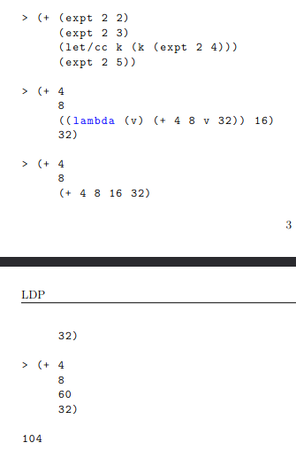

[<- Índice](../LenguajesProgramacion.md)
# Expresiones `let/cc`

Una ==**continuación**== es un concepto fundamental en la teoría de los lenguajes de programación que representa =="el resto del programa"== o lo que queda por hacer después de un punto dado en la ejecución.

Formalmente, una continuación es una función que captura el contexto de ejecución en un momento específico, permitiendo controlar explícitamente lo que sucede despues de evaluar una expresión.

> Es un programa, una continuación permite *"capturar"* el estado actual de la ejecución y, en algun momento posterior, regresar a ese estado o cambiar lo que sucede después.

### ¿Porqué es importante estudiar continuaciones?

1. ***Control del flujo de ejecución***

Las continuaciones permiten modificar el flujo de ejecución de un programa de manera precisa. Esto es útil para construir mecanismos como excepciones, cortes tempranos (*early exits*) y co-rutinas.

2. ***Implementación de funcionalidades avanzadas***

A través de las continuaciones se pueden implementar características como:

- ***Backtracking***: Permiten volver a un punto anterior del programa, algo que es útil en algoritmos que prueban múltiples caminos posibles (como los lenguajes de programación lógicos).

- ***Excepciones***: Capturar una excepción y decidir que hacer después se puede modelar con continuaciones.

- ***Corutinas y Multitarea***: Las corutinas, que permiten que 2 funciones se suspendan y reanuden mutuamente, pueden implementarse usando continuaciones para cambiar el control de una a otra.

3. ***Estilo de Paso de Continuaciones (CPS)***: En el ==estilo de paso de continuaciones (CPS)==, cada función toma una continuación extra como argumento, que especifíca lo que debe suceder despues de que la función termine.

- Estudiar *CPS* te proporciona una visión profunda de como un lenguaje maneja el control de flujo de manera explícita y cómo puedes transformar cualquier programa en *CPS*.

### Aplicación en Teoría de Lenguajes de Programación

1. **Exploran el control de flujo de forma explícita**: Ayudan a entender como los lenguajes manejan funciones como el retorno de valores, excepciones, o saltos en diferentes partes del código.

2. **Fundamentos en la semántica**: Las continuaciones ofrecen un mecanismo formal de describir cómo las expresiones son evaluadas, lo cual es útil cuando estudiamos la semántica formal de lenguajes.

3. **Compilación y optimización**: En compiladores, las continuaciones son esenciales para implementar técnicas de optimización y transformar programas de alto nivel en código más eficiente.

## Programando con Continuaciones

Lenguajes de programación como *Racket* incluyen primitivas para capturar la continuación actual en un punto específico de la ejecución de un programa.

Una de las principales primitivas para manipular continuaciones es `let/cc` cuyo significado es *"let with current continuation"* y permite capturar la continuación actual en cualquier momento durante la ejecución de un programa.

### ¿Qué hace `let/cc`?

`let/cc` captura la continuación actual y nos da la opción de usarla en un cuerpo (expresión) que se especifíca justo despues de la primitiva.

Esto nos da la posibilidad de usar la continuación capturada para regresar al estado de ejecución en el momento exacto en que se capturó la continuación.

La sintaxis de `let/cc` en *Racket* es la siguiente:

$\texttt{(let/cc k}$
$\hspace{2cm}\texttt{<cuerpo>)}$

Aqui $\texttt{k}$ es la continuación capturada. Podemos invocar a $\texttt{k}$ en cualquier punto del cuerpo para regresar a ese estado y reanudar la ejecución desde allí.

Por ejemplo, para la siguiente expresión:

$\texttt{(+ (expt 2 2) (expt 2 3) (expt 2 4) (expt 2 5))}$

Si se detiene la ejecución justo antes de calcular $\texttt{(expt 2 4)}$, el programa habrá calculado $\texttt{(+ (expt 2 2) (expt 2 3))}$ hasta ese momento.

Cuando se haya calculado $\texttt{(expt 2 4)}$, la expresión continuará obteniendo el valor de $\texttt{(expt 2 5)}$ y lo sumará con el cálculo que ya tenía.

De esta forma, se dice que la continuación del punto $\texttt{(expt 2 4)}$ es el resto de la ejecución del programa, es decir, el cómputo pendiente.

> Podemos representar entonces la continuación en ese punto mediante la siguiente función:

$$
\texttt{(lambda (v) (+ (expt 2 2) (expt 2 3) v (expt 2 4)))}
$$

El parámetro $\texttt{v}$ representa el punto actual que puede ser remplazado por un valor diferente.

Podemos reescribir la expresión anterior mediante `let/cc` para hacer explícita la continuación:

$\texttt{(+ (expt 2 2) (expt 2 3) (let/cc k (k (expt 2 4))) (expt 2 5))}$

El valor de la variable $\texttt{k}$ es la continuación que construimos anteriormente en base a esta expresión:

$\texttt{(lambda (v) (+ (expt 2 2) (expt 2 3) v (expt 2 5)))}$

### Escapes

¿Cómo debería evaluarse la expresión anterior? Veamos la ejecución paso a paso.

Sin embargo al ejecutar en *Racket* se obtiene 60 como resultado.

# Enlaces

[<- Anterior](LPNota22.md) |