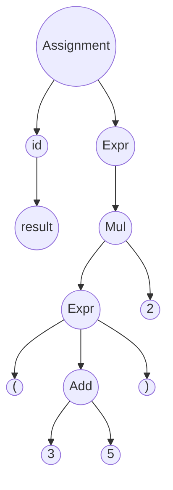

[<- Índice](../LenguajesProgramacion.md)

# Sintaxis abstracta

Proporciona una representación simplificada y estructural del código fuente y captura la lógica y la jerarquía del programa sin incluir los detalles específicos de la sintaxis concreta.

Esta representación se utiliza en forma de ==Árbol de Sintaxis Abstracta== (*ASA*), que facilita la manipulación y análisis del código durante las fases de compilación o interpretación.

Una representación clara y simplificada del código facilita la detección de errores, la optimización y la implementación de nuevas funcionalidades al legnuaje.

Además proporciona una base estándar para el ==análisis sintáctico==, se mejora la compatibilidad entre diferentes herramientas y entornos de desarrollo.

### Un ejemplo para ganar intuición

Supongamos que tenemos una calculadora simple que soporta operaciones aritméticas básicas: suma (+) y multiplicación (\*) y utilizamos paréntesis para definir precedencia.

Tomemos el siguiente programa como ejemplo:

> `resultado = (3 + 5) * 2`

#### Árbol de Sintaxis concreta

Podemos representar este programa en un ==Árbol de Sintaxis Concreta== (*ASC*). Este árbol incluye todos los detalles del código fuente como paréntesis y operadores.

En el *ASC*, cada elemento del código, incluyendo los paréntesis, se representa explícitamente, lo que hace que el árbol sea más detallado y complejo.

# Enlaces

[<- Anterior](LPNotaClase04.md) |