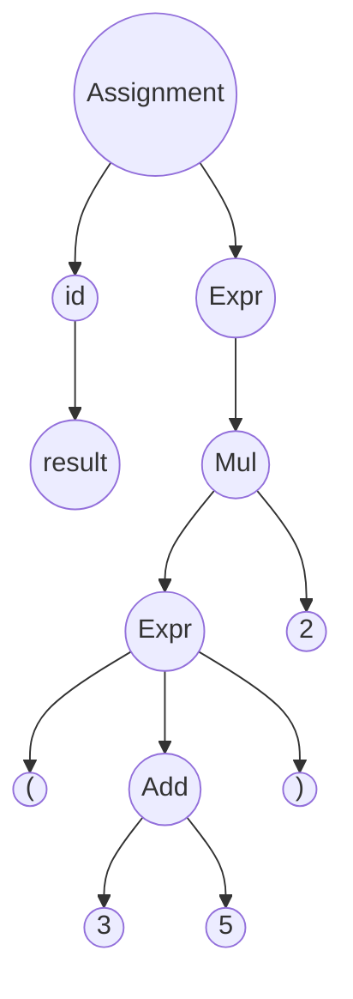
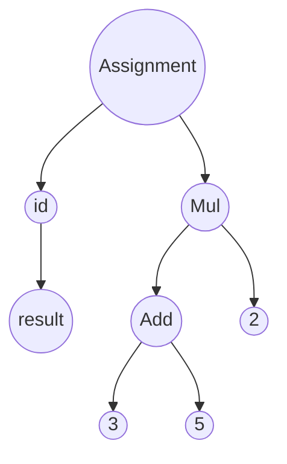
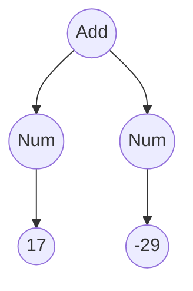

[<- Índice](../LenguajesProgramacion.md)

# Sintaxis abstracta

Proporciona una representación simplificada y estructural del código fuente y captura la lógica y la jerarquía del programa sin incluir los detalles específicos de la sintaxis concreta.

Esta representación se utiliza en forma de ==Árbol de Sintaxis Abstracta== (*ASA*), que facilita la manipulación y análisis del código durante las fases de compilación o interpretación.

Una representación clara y simplificada del código facilita la detección de errores, la optimización y la implementación de nuevas funcionalidades al legnuaje.

Además proporciona una base estándar para el ==análisis sintáctico==, se mejora la compatibilidad entre diferentes herramientas y entornos de desarrollo.

### Un ejemplo para ganar intuición

Supongamos que tenemos una calculadora simple que soporta operaciones aritméticas básicas: suma (+) y multiplicación (\*) y utilizamos paréntesis para definir precedencia.

Tomemos el siguiente programa como ejemplo:

> `resultado = (3 + 5) * 2`

#### Árbol de Sintaxis concreta

Podemos representar este programa en un ==Árbol de Sintaxis Concreta== (*ASC*). Este árbol incluye todos los detalles del código fuente como paréntesis y operadores.

En el *ASC*, cada elemento del código, incluyendo los paréntesis, se representa explícitamente, lo que hace que el árbol sea más detallado y complejo.

#### Árbol de Sintaxis Abstracta

El árbol de sintaxis abstracta omite los detalles innecesarios y se centra en la estructura lógica de la expresión:

En el *ASA*, los paréntesis no se representan explícitamente, en cambio, se conserva la estructura jerárquica de las operaciones, con la multiplicación en el nivel superior y la suma como una de sus operandos.

##### Beneficios de la sintaxis abstracta

- **Simplicidad y claridad**

- **Facilita el análisis y transformación**: Por ejemplo, el compilador puede facilmente identificar subexpresiones y aplicar optimizaciones algebraicas.

- **Reducción de complejidad**: Ya que eliminar elementos sintácticos redundantes, mejorando la eficiencia de las herramientas de análisis.

## Definición formal

> Un **árbol de sintaxis abstracta** es un arbol ordenado $A=(N,A,R)$ donde:
>
> - $N$ es un conjunto conjunto finito de nodos que representan las construcciones del lenguaje mediante etiquetas y las hojas representan a sus respectivos valores.
>
> - $A \subseteq (N \times N)$ es un conjunto de aristas dirigidas que conectan a los nodos.
>
> - $R \in N$ es la raíz del nodo

### Representación mediante reglas de inferencia

Las reglas de inferencia son una manera formal de especificar cómo las construcciones sintácticas de un lenguaje de programación forman estructuras más complejas.

Además nos permite especificar las reglas de construcción de los árboles de manera compacta.

#### Ejemplo 1: Sintaxis abstracta de MiniLisp

Retomando la sintaxis concreta [[LPNotaClase04#Ejemplo MiniLisp]]

Particularmente en la sección:

> \<Expr\> := \<Int\> | (+ \<Expr\> \<Expr\>) | (- \<Expr\> \<Expr\>)

Entendemos que tenemos 3 tipos de expresiones:

- **Enteros**: A los que representaremos con la etiqueta *Num*. Ya que son valores atómicos, únicamente tendran como hijo al valor entero que representan.

- **Sumas**: Las cuales etiquetaremos como *Add*. Como podemos apreciar en la gramática, las sumas requieren 2 expresiones, por lo que tendra 2 nodos hijos, no hojas

- **Restas**: Las cuales etiquetaremos como *Sub*.

Ahora, para definir las reglas que nos permitan especificar los *ASA*, definimos la siguiente relación:

> a *ASA*

que se lee como *a* es un *ASA*. Dicho esto definimos las reglas y colocamos una descripción de cual sería su lectura:

##### Números

*Num(n)* es un *ASA* si $n \in \mathbb{Z}$

>    $n \in \mathbb{Z}$
> \- \- \- \- \- \-
> *Num(n) ASA*

##### Suma

*Add(i,d)* es un *ASA* si tanto *i* como *d* son ASAs también.

>    $i \; ASA \quad d \; ASA$
> \- \- \- \- \- \- \- \- \- \- \- \-
>    *Add(i,d) ASA*

##### Resta

*Sub(i,d)* es un *ASA* si tanto *i* como *d* son ASAs también.

>    $i \; ASA \quad d \; ASA$
> \- \- \- \- \- \- \- \- \- \- \- \-
>    *Sub(i,d) ASA*

#### Ejemplo 2: Representación gráfica de un ASA

Usando la especificación del ejemplo anterior, podemos obtener el *ASA* de (+ 17 -29) de 2 formas distintas:

##### Representación en formato plano

> *Add(Num(17), Num(-29))*

##### Representación en formato de árbol

### De la SIntaxis Concreta a la Sintaxis Abstracta

Se plantea la relación entre la sintaxis concreta y la abstracta como la composición de las funciones de análisis léxico y análisis sintáctico que mencionamos anteriormente.

La función `lexer` transforma el texto fuente en una secuencia de *tokens* y la función `parser` transforma esa secuencia de *tokens* en una estructura jerárquica como un *ASA*.

#### Definición formal

Sea $lexer \; : \; S \rightarrow [Token]$ y $parser \; : \; [Token] \rightarrow ASA$, la relación entre la sintaxis concreta y la abstracta, denotada como $\phi$ , se puede definir como la composición de las funciones `lexer` y `parser`:

> $\phi = lexer \; \circ \; parser \; : \; S \rightarrow ASA$

Donde, por ejemplo, $\phi((+ \; 17 \quad -29)) \; = \; Add(Num(17), \; Num(-29))$

# Introducción a semántica

Vamos a tener 2 tipos de semánticas: **Semántica estática** y **Semántica dinámica**.

Por ahora nos centraremos más en la *semántica dinámica*.

> La semántica dinámica trata de modelar el comportamiento de los programas

A grosso modo, se encarga de combinar los constructores para obtener un resultado. Hay varias formas de hacer esto:

- **Semántica denotativa**: Relaciona programas con objetos matemáticos para modelar razonamientos formales. **Nivel avanzado**

- **Semántica axiomática**: Esta semántica se utiliza más para verificar programas a partir de precondiciones y postcondiciones. Verifica las condiciones lógicas de las operaciones (que el programa cumpla lo que debe hacer).

- **Semántica operacional**: Nos enfocaremos en esta durante el curso. Define el significado de los programas mediante la especificación de reglas de transición

### Semántica operacional

Tenemos 2 tipos de semántica operacional:

- **Semántica de paso pequeño**
- **Semántica de paso grande**

# Enlaces

[<- Anterior](LPNotaClase04.md) | [Siguiente ->](LP22_08_2024.md)