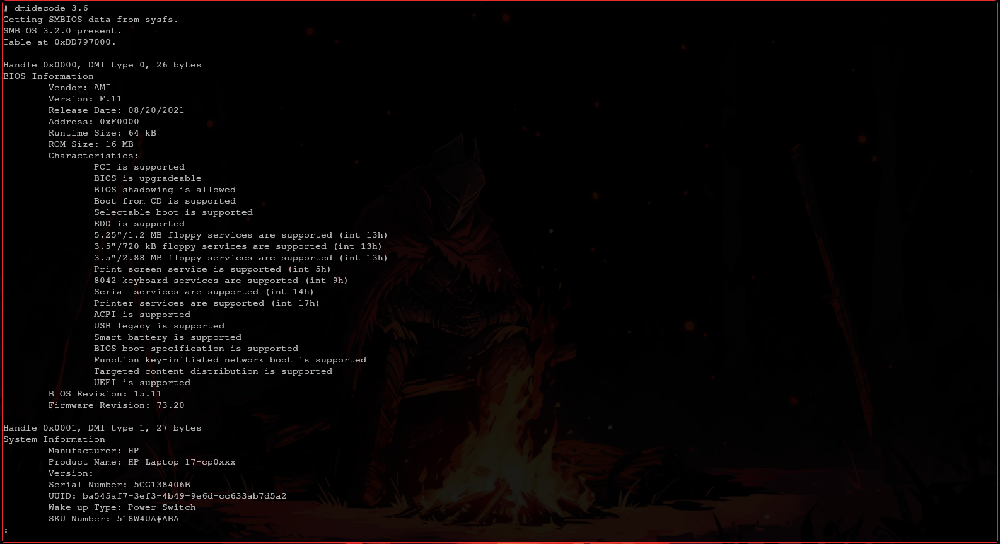

[<- Índice](../SistemasOperativos.md)
# Controladores y Drivers 

> A lo largo del curso, trabajaremos con un esquema típico de ejecución concurrente de un sistema operativo como es el siguiente:


Todos estos controladores comparten con el *CPU* el acceso a la memoria, con el apoyom de *busses* presentes en el sistema.
Un **bus** no es más un sistema de comunicación presente a bajo nivel entre los componentes internos del *Hardware* de una computadora, como **CPU**, memoria **RAM**, **controladores** y **periféricos**.

Recordemos que un **controlador** esta relacionado al *Hardware*, mientras que un **Driver** esta relacionado al *Software*. Ambos con el objetivo de permitir la comunicación entre el *Kernel* y los demás dispositivos del sistema por lo que la compatibilidad entre *Driver* y Controlador es crucial.

## Terminal

> A continuación, algunos comandos que nos dan información acerca de los componentes de nuestra computadora, en sistemas *Linux*.

#### Archivo `/proc/cpuinfo`

Nos brinda información acerca del procesador de la computadora.

```bash
less /proc/cpuinfo
```


#### `dmidecode`

Brinda información relacionada a la *BIOS* o *UEFI* de la computadora, por ejemplo **modelo de la placa base**, del **CPU**, **RAM**, detalles del fabricante, **números de serie**, versión del **firmware**, etc.

```bash
sudo dmidecode
```



#### Listar bussers PCI

Un **bus PCI** (*Peripheral Component Interconnect*) es un **bus de expansión** que permite la conexión entre los dispositivos del *Hadware* con la **placa base** del computador.

```bash
lspci
```

Este comando lista, con identificadoes, todos los **controladores** asignados a **bussers** configurados en el dispositivo.


#### Controladores de USB

Podemos listar los **controladores USB** del sistema con apoyo del siguiente comando:

```bash
lsusb
```


Además posee las siguientes opciones:

```bash
lsusb -h

# Usage: lsusb [options]...
# List USB devices
#   -v, --verbose
#       Increase verbosity (show descriptors)
#   -s [[bus]:][devnum]
#       Show only devices with specified device and/or
#       bus numbers (in decimal)
#   -d vendor:[product]
#       Show only devices with the specified vendor and
#       product ID numbers (in hexadecimal)
#   -D device
#       Selects which device lsusb will examine
#   -t, --tree
#       Dump the physical USB device hierarchy as a tree
#   -V, --version
#       Show version of program
#   -h, --help
#       Show usage and help
```

#### Vista gráfica de la Topología del Hardware

La **topología** del *Hardware* comprende información acerca del **CPU** como hilos y núcleos, **Jerarquía de memoria y caché**, **Nodos NUMA**, **Interfaces de red**, etc.

Con el siguiente comando, obtenemos una representación gráfica de esta topología:

```bash
lstopo
```


---

Podría decirse que un **sistema de cómputo** es una ***colisión ordenada*** de procesadores, memoria *RAM*, controladores, *busses* e interrupciones.

# Enlaces

[<- Anterior](SO_29_01_2025.md) | [Siguiente ->](SO_31_01_2025.md)