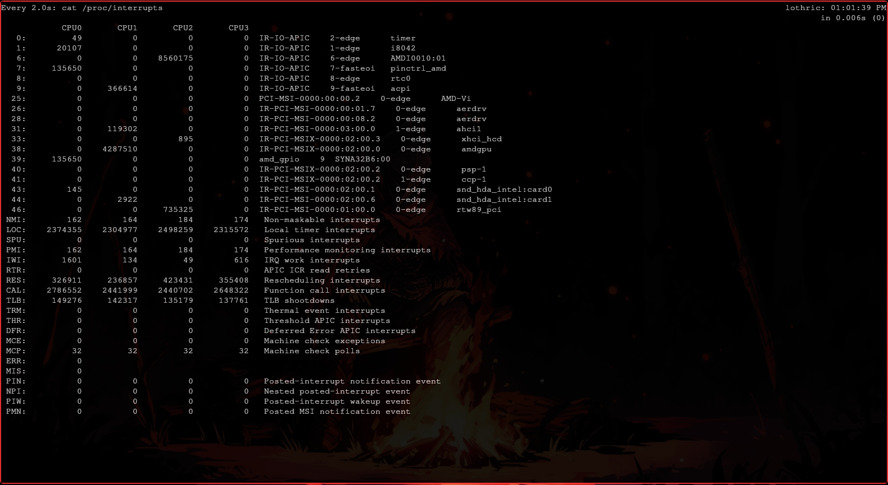

[<- Índice](../SistemasOperativos.md)
# Procesos (modo usuario y modo supervisor)

> Todo proceso en el sistema tiene 2 estas: ***modo usuario*** y ***modo supervisor***.

En el ***modo usuario*** se habilita una serie de unidades de protección para evitar la ejecución de subrutinas e interrupciones privilegiadas.

Por otra parte, en el ***modo supervisor*** estas protecciones no estan presentes, poseyendo un control absoluto de las acciones del computador, incluso si éstas son peligrosas.

Por otra parte, podemos decir que todos los procesos son el propio **Kernel** con la personalidad del **programa de aplicación** que representa.
Un proceso sin **Kernel** no puede existir por si solo, simplemente alterna entre su *"personalidad"* de **modo usuario** y aquella de **modo supervisor**.

Cuando un proceso, bajo personalidad de **modo usuario**, requiere alguna ejecución o servicio, ==emite una instrucción denominada **interrupción**== para que la *"personalidad"* del **Kernel o supervisor** tome el control y ejecute dicha instrucción si el usuario de origen tiene los permisos.

## Terminal

#### Interrupciones

```bash
watch cat /proc/interrupts
```



#### Seguimiento de las llamadas de un comando

Con apoyo del comando `strace` podemos analizar las llamadas a otras funciones que realiza el proceso que originamos, por ejemplo:

```bash
strace ps aux | less
```

# Enlaces

[<- Anterior](SO_30_01_2025.md) |