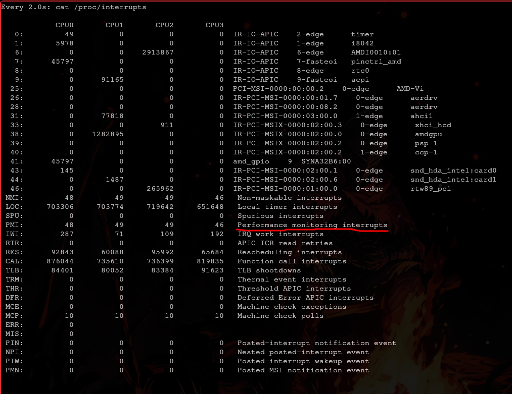

# Tarea 1
## Fernando Romero Cruz - Sistemas Operativos 2025-2

### Investigación

###### *¿Qué es el directorio `/proc` en Linux y cuál es su propósito?*
> Es un **sistema de archivos virtual** (y no un directorio real en el disco) cuyo objetivo es proporcionar una interfaz dinámica para acceder a la información del estado y los procesos presentes en el sistema.

###### **¿Qué es la tabla de interrupciones en un sistema operativo y para qué sirve?**
> Es una **estructura de datos** en memoria que almacena las direcciones de las subrutinas que deben ejecutarse cuando ocurre una interrupción.
> De este modo, cuando es invocada una interrupción, el procesador consulta la tabla y ejecuta la rutina correspondiente según sea el caso.

###### **¿Qué son los controladores de dispositivos y cuál es su importancia en un sistema operativo?**
> Los **controladores de dispositivos** son componentes del *Hardware* de la computadora que funcionan como intermediarios entre el **CPU** y su dispositivo asociado, ya sea un disco, una interfaz de red, una tarjeta gráfica, etc.
>
> Su importancia radica en que posibilitan la comunición entre su dispositivo y el procesador, permitiendo la interacción del dispositivo con la computadora en general.

### Actividad práctica

#### Linux

Investiga los comandos en *Linux* para poder responder las siguientes preguntas:

###### **¿Cuántos núcleos tiene tu CPU?**
> Con el comando `lscpu`, y filtrando la información que quería de la siguiente manera:

```bash
lscpu | grep Core
```

Obtuve la salida:
`Core(s) per socket:                   2`

Ésta indica que mi procesador tiene 2 núcleos.

###### **¿Cuánta memoria RAM está instalada y cómo está distribuida?**
> En esta ocasión utilice el comando `free`, tengo 8 *GB* de *RAM* distribuida de la siguiente manera.

Es buena idea adicionar la bandera `-h` para que la información se presente en un formato más entendible para un humano.

```
        total       used       free     shared  buff/cache  available
Mem:    5.7Gi      2.8Gi      1.5Gi       91Mi       1.7Gi      2.8Gi
Swap:   8.0Gi         0B      8.0Gi
```

Descubrí que este comando también informa acerca del estado de la partición *swap* presente en mi computadora.

###### **¿Qué controlador utiliza un dispositivo conectado por PCI?**
> Con el comando `lspci`, descubrí que mi interfaz de red *Wifi* está conectada por *PCI*.

![[T1_lspci.png]]

Para obtener más información, primero identifiqué su *ID* a partir del número que le precede (`01:00.0`) con:

```bash
lspci -n
```

Y me fijé en la línea:

```
...
01:00.0 0280: 10ec:a85a
...
```

Con la tercera sección (`10ec:a85a`), pude filtrar este dispositivo y aumentar la verbosidad así:

```bash
sudo lspci -d 10ec:a85a -v
```

```
01:00.0 Network controller: Realtek Semiconductor Co., Ltd. RTL8852AE WiFi 6 802.11ax PCIe Adapter
	Subsystem: Hewlett-Packard Company Device 88e2
	Flags: bus master, fast devsel, latency 0, IRQ 46, IOMMU group 7
	I/O ports at f000 [size=256]
	Memory at fcf00000 (64-bit, non-prefetchable) [size=1M]
	Capabilities: <access denied>
	Kernel driver in use: rtw89_8852ae
	Kernel modules: rtw89_8852ae
```

De esta manera tenemos mucha más información valiosa que con la salida convencional.

###### **Describa el propósito de una interrupción específica en tu sistema.**
> Con `watch cat /proc/interrupts`, note la interrupción `Performance Monitoring Interrupts`, utilizada por procesadores modernos para monitorear el rendimiento del sistema y causadas cuando un contador **PMC** (*Performance Monitoring Counter*) alcanza un valor predefinido.



Me llamó la atención por tener un nombre reconocible además de que creo que es indispensable para el monitoreo del sistema a bajo nivel.

###### **¿Qué información puedes obtener sobre el controlador de un dispositivo USB?**
> Con el comando `lsusb` obtuve la siguiente salida:

```
Bus 001 Device 001: ID 1d6b:0002 Linux Foundation 2.0 root hub
Bus 001 Device 002: ID 05e3:0608 Genesys Logic, Inc. Hub
Bus 001 Device 003: ID 04f2:b710 Chicony Electronics Co., Ltd HP TrueVision HD Camera
Bus 001 Device 004: ID 0bda:385a Realtek Semiconductor Corp. Bluetooth Radio
Bus 002 Device 001: ID 1d6b:0003 Linux Foundation 3.0 root hub
```

Utilizando el número de *Bus* y de *Device*, pude filtrar mi cámara y adicionar verbosidad con el comando:

```bash
sudo lsusb -s 1:3 -v
```

Esto arroja muchísima información, de modo que tome las primeras 18 líneas que comprenden la descripción del dispositivo, filtrando con:

```
sudo lsusb -s 1:3 -v | head -n 18
```

Así obtuve la salida:

```
Bus 001 Device 003: ID 04f2:b710 Chicony Electronics Co., Ltd HP TrueVision HD Camera
Negotiated speed: High Speed (480Mbps)
Device Descriptor:
  bLength                18
  bDescriptorType         1
  bcdUSB               2.01
  bDeviceClass          239 Miscellaneous Device
  bDeviceSubClass         2 [unknown]
  bDeviceProtocol         1 Interface Association
  bMaxPacketSize0        64
  idVendor           0x04f2 Chicony Electronics Co., Ltd
  idProduct          0xb710 HP TrueVision HD Camera
  bcdDevice           27.47
  iManufacturer           3  
  iProduct                1 HP TrueVision HD Camera
  iSerial                 2 0001
  bNumConfigurations      1
```

Debajo de esta información se encuentran muchísimas descripciones de la configuración para este controlador.