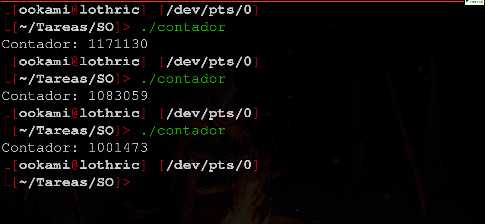
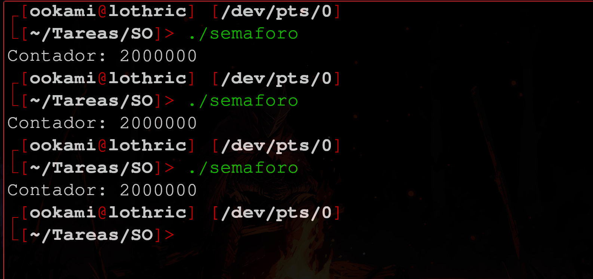

# Tarea 3 - Sistemas Operativos

> Fernando Romero Cruz - 319314256

### Implementación

1. Escribe un programa en C que cumpla con los siguientes requisitos:
	- Declare una variable global de tipo entero (int) que se utilizar ́a como contador.
	- Cree dos hilos (threads) utilizando la biblioteca pthread.
	- Cada hilo incremente la variable global 1,000,000 de veces.
	- Se debe usar pthread join() para esperar a que los hilos terminen su ejecuci ́on
	- Al final del programa, imprime el valor final de la variable global.

```c
#include <stdio.h>
#include <pthread.h>

// Variable global compartida
int contador = 0;

// Función que ejecutarán los hilos
void *incrementar(void *arg) {
    for (int i = 0; i < 1000000; i++) {
        contador++; // Incremento sin protección contra condiciones de carrera
    }
    return NULL;
}

int main() {
    pthread_t hilo1, hilo2;

    // Crear dos hilos
    pthread_create(&hilo1, NULL, incrementar, NULL);
    pthread_create(&hilo2, NULL, incrementar, NULL);

    // Esperar a que los hilos terminen
    pthread_join(hilo1, NULL);
    pthread_join(hilo2, NULL);

    // Imprimir el valor final del contador
    printf("Contador: %d\n", contador);

    return 0;
}
```

2. Corre el programa por lo menos 3 veces y documenta si observas diferencias entre las ejecuciones



> Efectivamente hay una diferencia entre los 3 valores obtenidos, si bien son aproximados, son claramente distintos.

3. Modifica la implementación anterior con semáforos para quitar la condición de carrera.

```c
#include <stdio.h>
#include <pthread.h>
#include <semaphore.h>

// Variable global compartida
int contador = 0;
sem_t semaforo;  // Declaración del semáforo

// Función que ejecutarán los hilos
void *incrementar(void *arg) {
    for (int i = 0; i < 1000000; i++) {
        sem_wait(&semaforo); // Bloquea el acceso
        contador++;          // Sección crítica
        sem_post(&semaforo); // Libera el acceso
    }
    return NULL;
}

int main() {
    pthread_t hilo1, hilo2;

    // Inicializar el semáforo con valor 1 (binario)
    sem_init(&semaforo, 0, 1);

    // Crear los hilos
    pthread_create(&hilo1, NULL, incrementar, NULL);
    pthread_create(&hilo2, NULL, incrementar, NULL);

    // Esperar a que los hilos terminen
    pthread_join(hilo1, NULL);
    pthread_join(hilo2, NULL);

    // Destruir el semáforo
    sem_destroy(&semaforo);

    // Imprimir el valor final del contador
    printf("Contador: %d\n", contador);

    return 0;
}
```

> Ahora podemos observar que los resultados son siempre iguales:



### Análisis

1. Explica qué es una condición de carrera y por qué ocurre en el primer programa.

> Porque se da una *race condition* donde ocurren *"colisiones"* al incrementar el valor del contador por parte de los hilos, causando que estos hilos actualicen el valor al mismo tiempo y al mismo valor, encimandose estas actualizaciones esperadas y resultando en un valor de contador menor al esperado.

2. Describe cómo los semáforos resuelven el problema de la condición de carrera.

> El semáforo se encarga de regular el acceso a la variable `counter`, evitando que más de un hilo modifique su valor a la vez y solucionando el *race condition* mencionado anteriormente.

3. Da un ejemplo distinto al contador donde se pueda presentar una *race condition*.

> Por ejemplo, cuando más de un hilo se encuentra modificando algún archivo, podria ocurrir una *race condition* y corromper el contenido de este.

4. ¿Qué es la sección crítica? (Coloca la sección crítica de las implementaciones previas)

> Las secciones críticas justo son aquellas donde podría presentarse una *race condition* debido a la modificación de valores por parte de varios hilos de forma simultánea.

Para la primera implementación, sin semaforos, esta es la sección crítica:

```c
// Función que ejecutarán los hilos
void *incrementar(void *arg) {
    for (int i = 0; i < 1000000; i++) {
        contador++; // Incremento sin protección contra condiciones de carrera
    }
    return NULL;
}
```

En cuanto a la segunda implementación, solucionando la *race condition*, se ve así:

```c
// Función que ejecutarán los hilos
void *incrementar(void *arg) {
    for (int i = 0; i < 1000000; i++) {
        sem_wait(&semaforo); // Bloquea el acceso
        contador++;          // Sección crítica
        sem_post(&semaforo); // Libera el acceso
    }
    return NULL;
}
```

5. ¿Qué es **Exclusión Mutua**?

> La **Exclusión Mutua** es otro mecanismo que busca evitar casos de *race condition*, encargandose de regular el acceso a **secciones críticas** a un solo hilo.

6. ¿Qué es un ***Deadlock*** (interbloqueo)?

> Un **Deadlock** ocurre cuando durante una *race condition*, 2 o más hilos se impiden el acceso simultáneamente a un recurso, debido a que todos están intentando interactuar con él y manteniendo en espera al resto de los hilos.