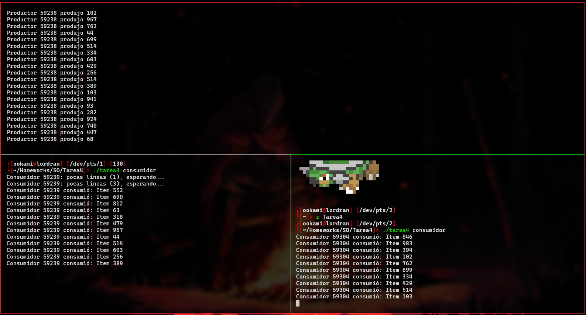

# Tarea 4

> Fernando Romero Cruz - *319314256*

### Ejecución

Para ejecutar mi archivo, únicamente hace falta compilarlo con la utilidad correspondiente.

Para sistemas *Linux* sería:

```bash
gcc tarea4.c -o tarea4
```

Una vez compilado, puede ejecutarse normalmente con la sintaxis (`./`), seguido del rol que deseamos que tenga, ya sea `consumidor` o `productor`.
Por ejemplo:

```bash
./tarea4
```

### Imágenes

